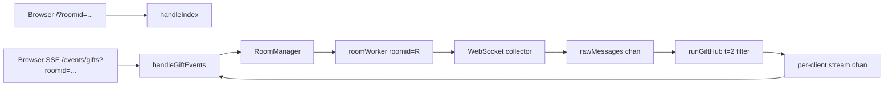

# SRWebSocket Prototype

このプロトタイプは、SHOWROOM の WebSocket メッセージから `t=2` (ギフト) だけを抽出し、SSE + HTMX でブラウザへ逐次表示します。

## 仕組み

- ブラウザは `/?roomid=12345` のように room を指定してアクセス
- HTTP ハンドラーは room manager に購読要求を送る
- room worker が存在すれば再利用、なければ起動
- room worker は次を room ごとに保持
  - WebSocket 接続 (`bcsvrkey`)
  - ギフト辞書 (`ApiLiveGiftlist`)
  - ギフト配信ハブ
- 購読者が 0 人になると idle timer 開始、タイムアウトで worker 停止

表示行数は `Envelope.go` の `maxTableRows` で固定です。

## データフロー



## ファイル構成

- `main.go`
  - 起動、HTTP サーバー起動、room manager 初期化
- `room_manager.go`
  - room worker の生成/再利用、購読数管理、idle timeout 停止
- `websocket_client.go`
  - WebSocket 接続と受信ループ
- `processReceivedMessage.go`
  - `t=2` 抽出、ハブ処理、購読者配信
- `GetBcsvrkey.go`
  - `roomid -> bcsvrkey` 解決、room ごとのギフト辞書取得
- `web.go`
  - ハンドラー、SSE 送信、テンプレート描画
- `templates/handleIndex.gtpl`
  - 画面テンプレート（roomid付き SSE 接続）
- `templates/handleGiftEvents.gtpl`
  - SSE で送る `<tr>` テンプレート

## 実行方法

```bash
go run .
```

既定の待受は `:8080` です。必要なら `-listen :8090` のように変更できます。

起動後、以下のように room を指定してアクセスします。

```text
http://localhost:8080/?roomid=495448
```

`room worker` の idle timeout は `-idle-timeout` で変更できます。

```bash
go run . -idle-timeout 2m
```
